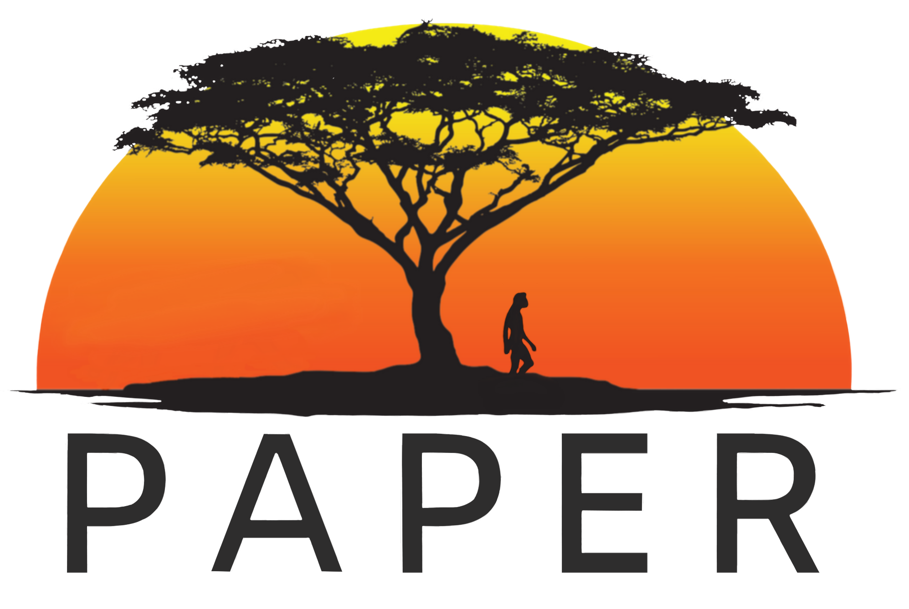

Welcome to the GWU Paleoanthropology and Paleoecology Research (PAPER) Lab! We study human evolution in Africa from an environmental and ecological perspective. Our lab uses a combination of field- and laboratory-based approaches.

The PI of the lab is <a href="/andrew-barr/">W. Andrew Barr</a>.